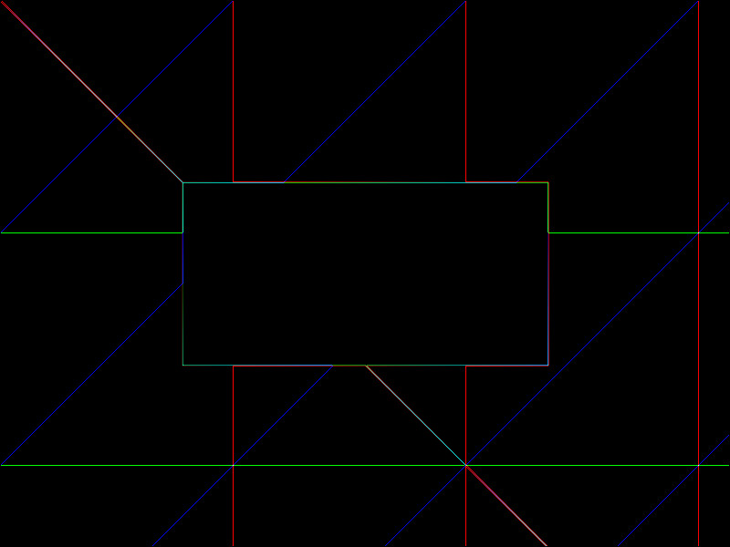
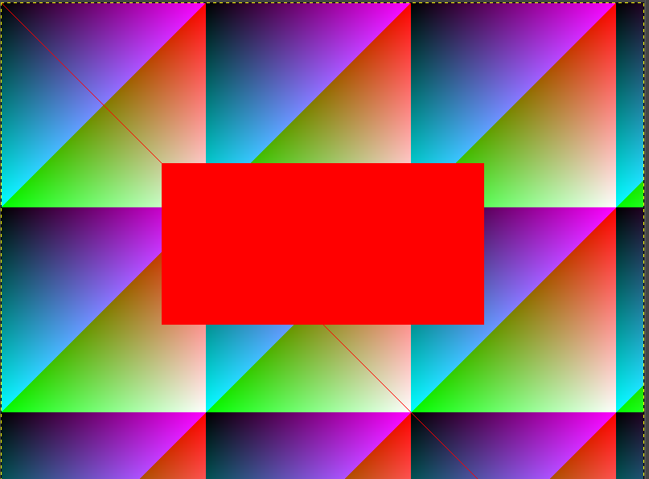

# ex1
## question1


-Le fichier main.c contient le code principal qui génère deux images PPM. Tout d'abord, il initialise deux structures d'images PPM, src_img et dest_img, avec une largeur de 800 pixels et une hauteur de 600 pixels. Ensuite, il dessine des motifs sur src_img, y compris des variations de couleurs en fonction des coordonnées des pixels et une diagonale rouge, puis il dessine un carré rouge à des coordonnées spécifiques. Enfin, il applique une opération de détection de contours (convolution avec un laplacien) sur src_img et enregistre les résultats dans dest_img. Les images générées sont ensuite enregistrées dans deux fichiers distincts : "carre.ppm" pour l'image initiale avec le carré rouge et "contours.ppm" pour l'image des contours détectés. 

1. Inclusions de bibliothèques :


```bash
#include <stdio.h>
#include "ppm.h"

```
2. Définition des fonctions :

draw_square(struct ppm_image *im, int x1, int y1, int x2, int y2, unsigned char r, unsigned char g, unsigned char b) : Cette fonction dessine un carré rouge dans une image PPM donnée (im) aux coordonnées spécifiées (x1, y1, x2, y2) avec la couleur spécifiée par les valeurs des composantes RGB (r, g, b).
apply_laplacian(struct ppm_image *src, struct ppm_image *dest) : Cette fonction applique une opération de convolution avec un laplacien pour détecter les contours dans une image source donnée (src) et stocke le résultat dans une image de destination (dest).

3. Fonction main() :
   
   *`draw_square`(struct ppm_image *im, int x1, int y1, int x2, int y2, unsigned char r, unsigned char g, unsigned char b) : Cette fonction dessine un carré rouge dans une image PPM donnée (im) aux coordonnées spécifiées (`x1`,`y1`,`x2`,`y2`) avec la couleur spécifiée par les valeurs des composantes RGB (`r`,`g`,`b`).
   
   `1. contours.ppm`

   `Cette image présente les contours détectés de l'image précédente (carre.ppm). Les contours sont visibles sous forme de lignes délimitant les régions où il y a des changements brusques dans les niveaux de luminosité. Les contours sont souvent utilisés pour mettre en évidence les frontières d'objets dans une image et sont obtenus ici grâce à une opération de détection de contours basée sur une convolution avec un laplacien.`
   


`2. carre.ppm`

`* Cette image contient un motif composé d'un carré rouge dessiné sur un fond avec des variations de couleurs en fonction des coordonnées des pixels. Le carré rouge est centré dans l'image et occupe une partie significative de celle-ci.`



